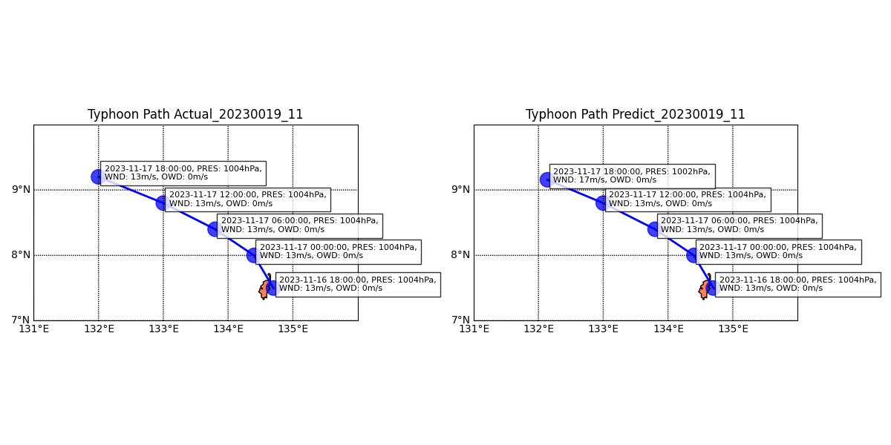

# Typhoon Path Prediction

> A Typhoon Path Prediction Model Implemented Using LSTM

## Table of Contents

- [Overview](#overview)
- [Installation](#installation)
- [Data preparation](#data-preparation)
- [Feature selection](#feature-selection)
- [Model training](#model-training)
- [Prediction](#prediction)
- [License](#license)

---

## Overview

Provides the complete code for the entire workflow, including data preparation, feature extraction, model training, prediction, and visualization of the results. The model uses typhoon data from the previous 4 time points to predict the typhoon data for the next time point.

---

### Installation

Step-by-step instructions on how to install and run your project locally.

```bash
# Clone this repository
$ git clone https://github.com/veraleiwengian/typhoon-path-prediction.git

# Go into the repository
$ cd typhoon-path-prediction

# Install dependencies
$ pip install -r requirements.txt
```

---

### Data preparation

[CMA Tropical Cyclone Best Track Dataset](https://tcdata.typhoon.org.cn/en/zjljsjj.html)


Use `$python3 data_clean.py` to clean the dataset.

The differences from the original dataset include the addition of an `END` column to record the end of the tropical cyclone:

0 indicates not ended, 

1 indicates dissipation, 

2 indicates movement out of the Western Pacific Typhoon Committee’s responsibility area, 

3 indicates merging, 

4 indicates quasi-stationary. 

Additionally, two columns, `distance_km` and `bearing`, have been added to represent the Haversine distance and bearing angle for the typhoon’s movement from the previous time point to the current time point.

---

### Feature selection

Convert `Time` into hour, day, month, and year cycles.

The above features, as well as the bearing, are captured using sine and cosine transformations to account for more complex non-linear relationships.

The `I` and `END` columns are transformed using one-hot encoding, while the remaining columns are normalized using min-max normalization.

---

### Model training

Use `python3 train.py` to train the model.

The criterion used is SmoothL1Loss, which is more robust to outliers than MSELoss, 

and the optimizer is AdamW, which combines the benefits of Adam with weight decay for better generalization. 

The first 90% of the data is used as training data, and the remaining 10% is used for validation. The best model is saved based on the validation loss.

---

### Prediction

Use `python3 predict.py` to test the model. 

You can specify a typhoonID, and based on the dataset, the model will input the data from the previous 4 time points to predict the next time point. 

A comparison plot between the predicted and actual data will be generated.



---

### License

This project is licensed under the MIT License.